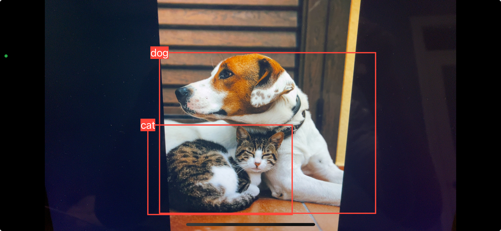

# YOLOv8SwiftUI

YOLOv8SwiftUI is a SwiftUI app that uses the YOLOv8s model to detect objects in the live camera feed.

## Getting Started

1. Clone the repository
2. Open the project in Xcode
3. Run the project on a physical device
4. Allow camera access
5. Point the camera at objects to detect them

## Screenshot

## Credits

* [YOLOv8](https://docs.ultralytics.com/models/yolov8/) - The object detection model used
* The sample image used for the screenshot, Photo by <a href="https://unsplash.com/@alecfavale?utm_content=creditCopyText&utm_medium=referral&utm_source=unsplash">Alec Favale</a> on <a href="https://unsplash.com/photos/short-coated-white-and-brown-puppy-Ivzo69e18nk?utm_content=creditCopyText&utm_medium=referral&utm_source=unsplash">Unsplash</a>
  
